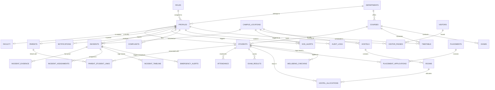

# CampusShield AI — Database Design & Schema Architecture

> **Author**: Database Architect  
> **Platform**: Supabase PostgreSQL 15+  
> **Status**: Verified & Active  
> **Security Model**: Defense-in-Depth with PostgreSQL Row Level Security (RLS) + RBAC  

---

## 1. Executive Summary & Design Principles

CampusShield AI is an enterprise-grade AI-powered campus safety and smart education management platform. The database foundation is engineered to provide:
1. **Zero-Trust Security**: Defense-in-depth with mandatory Row Level Security (RLS) across all 32 tables.
2. **Sub-second Realtime Operations**: Realtime WebSocket event broadcasting for emergency SOS, live incident feeds, and campus safety command centers.
3. **High Normalization & Relational Integrity**: Third Normal Form (3NF) / Boyce-Codd Normal Form (BCNF) normalization with foreign keys, cascading rules, and check constraints.
4. **Privacy-Preserving Safety Workflows**: Native support for anonymous whistleblowing, sensitive incident redaction, parent-student access scoping, and counselor intervention.
5. **AI Integration Safety**: Isolated, structured AI classifications (`JSONB`) with confidence tracking and human-in-the-loop overrides.
6. **Immutable Auditability**: Complete forensic trace of all mutations with IP addresses, user agents, and timeline events.

---

## 2. Entity-Relationship Diagram (ERD)

---

## 3. Detailed Table Specifications

### 3.1. Authentication & System Core

#### `roles`
System-defined permission lookup dictionary.
| Column | Type | Constraints | Description |
|---|---|---|---|
| `id` | `UUID` | `PK, DEFAULT gen_random_uuid()` | Primary Key |
| `name` | `VARCHAR(50)` | `UNIQUE, NOT NULL` | Role code (`super_admin`, `admin`, `security`, etc.) |
| `display_name` | `VARCHAR(100)` | `NOT NULL` | Human-readable role title |
| `description` | `TEXT` | `NULLABLE` | Scope and responsibility overview |
| `hierarchy_level`| `INT` | `NOT NULL, DEFAULT 100` | Lower number = higher authority level |
| `permissions` | `JSONB` | `NOT NULL, DEFAULT '[]'` | Array of specific permission keys |
| `created_at` | `TIMESTAMPTZ`| `NOT NULL, DEFAULT now()` | Role creation timestamp |

#### `departments`
Academic, safety, and administrative divisions.
| Column | Type | Constraints | Description |
|---|---|---|---|
| `id` | `UUID` | `PK, DEFAULT gen_random_uuid()` | Primary Key |
| `code` | `VARCHAR(20)` | `UNIQUE, NOT NULL` | Department abbreviation (`CSE`, `SEC_OPS`, etc.) |
| `name` | `VARCHAR(100)` | `NOT NULL` | Full department name |
| `type` | `VARCHAR(50)` | `NOT NULL, CHECK (type IN (...))` | `academic`, `administrative`, `safety`, `facility`, `support` |
| `building` | `VARCHAR(100)` | `NULLABLE` | Campus building location |
| `head_profile_id` | `UUID` | `FK -> profiles(id) ON DELETE SET NULL` | Head of Department / Unit Chief |
| `contact_email` | `VARCHAR(255)` | `NULLABLE` | Official communication email |
| `contact_phone` | `VARCHAR(50)` | `NULLABLE` | Direct contact telephone |
| `is_active` | `BOOLEAN` | `NOT NULL, DEFAULT true` | Active operational status |
| `created_at` | `TIMESTAMPTZ`| `NOT NULL, DEFAULT now()` | Creation timestamp |
| `updated_at` | `TIMESTAMPTZ`| `NOT NULL, DEFAULT now()` | Auto-updated timestamp via trigger |

#### `campus_locations`
Vector-mapped campus nodes supporting SVG coordinate overlays and GPS geolocation.
| Column | Type | Constraints | Description |
|---|---|---|---|
| `id` | `UUID` | `PK, DEFAULT gen_random_uuid()` | Primary Key |
| `code` | `VARCHAR(50)` | `UNIQUE, NOT NULL` | Unique location code (`TECH_PARK`, `CHEM_LAB`) |
| `name` | `VARCHAR(100)` | `NOT NULL` | Building/Facility title |
| `zone` | `VARCHAR(50)` | `NOT NULL` | Campus zone (`Academic Hub`, `Hostel Quad`, etc.) |
| `type` | `VARCHAR(50)` | `NOT NULL, CHECK (...)` | `building`, `gate`, `lab`, `hostel`, `sports`, etc. |
| `svg_x` | `NUMERIC(8,2)`| `NOT NULL` | X-coordinate on custom campus SVG map (0-1000) |
| `svg_y` | `NUMERIC(8,2)`| `NOT NULL` | Y-coordinate on custom campus SVG map (0-1000) |
| `latitude` | `NUMERIC(10,7)`| `NULLABLE` | GPS Latitude |
| `longitude`| `NUMERIC(10,7)`| `NULLABLE` | GPS Longitude |
| `risk_level`| `VARCHAR(20)`| `NOT NULL, DEFAULT 'low'` | `low`, `medium`, `high`, `critical` |
| `is_emergency_hotspot` | `BOOLEAN` | `NOT NULL, DEFAULT false` | Flagged for prioritized security patrols |
| `capacity` | `INT` | `NULLABLE` | Estimated maximum safe occupancy |
| `created_at` | `TIMESTAMPTZ`| `NOT NULL, DEFAULT now()` | Creation timestamp |

#### `profiles`
User profiles extending Supabase `auth.users`.
| Column | Type | Constraints | Description |
|---|---|---|---|
| `id` | `UUID` | `PK, FK -> auth.users(id) ON DELETE CASCADE` | Identity UUID from Supabase Auth |
| `email` | `VARCHAR(255)` | `UNIQUE, NOT NULL` | User primary email address |
| `full_name` | `VARCHAR(150)` | `NOT NULL` | Full legal name |
| `role` | `VARCHAR(50)` | `NOT NULL, FK -> roles(name)` | Role designation |
| `department_id` | `UUID` | `FK -> departments(id) ON DELETE SET NULL` | Primary department affiliation |
| `phone` | `VARCHAR(30)` | `NULLABLE` | Verified contact phone |
| `avatar_url` | `TEXT` | `NULLABLE` | Public profile picture URL |
| `emergency_contact` | `JSONB` | `DEFAULT '{"name":"","relationship":"","phone":""}'` | Primary emergency contact |
| `is_active` | `BOOLEAN` | `NOT NULL, DEFAULT true` | Active system access |
| `metadata` | `JSONB` | `DEFAULT '{}'` | Extensible attributes & preferences |
| `created_at` | `TIMESTAMPTZ`| `NOT NULL, DEFAULT now()` | Registration timestamp |
| `updated_at` | `TIMESTAMPTZ`| `NOT NULL, DEFAULT now()` | Last update timestamp |

---

### 3.2. Academic ERP Core

#### `courses`
| Column | Type | Constraints | Description |
|---|---|---|---|
| `id` | `UUID` | `PK, DEFAULT gen_random_uuid()` | Course identifier |
| `code` | `VARCHAR(20)` | `UNIQUE, NOT NULL` | Program code (`CS-BTECH`, `MBA-CORE`) |
| `name` | `VARCHAR(150)` | `NOT NULL` | Full degree program title |
| `department_id` | `UUID` | `FK -> departments(id) ON DELETE RESTRICT` | Managing academic department |
| `degree_type` | `VARCHAR(50)` | `NOT NULL, CHECK (...)` | `B.Tech`, `M.Tech`, `BBA`, `MBA`, `Ph.D`, etc. |
| `duration_years`| `INT` | `NOT NULL, DEFAULT 4` | Program duration in years |
| `total_semesters`| `INT` | `NOT NULL, DEFAULT 8` | Total academic semesters |
| `total_credits` | `INT` | `NOT NULL, DEFAULT 160` | Graduation credit requirements |

#### `students`
| Column | Type | Constraints | Description |
|---|---|---|---|
| `id` | `UUID` | `PK, DEFAULT gen_random_uuid()` | Student record ID |
| `profile_id` | `UUID` | `UNIQUE, NOT NULL, FK -> profiles(id) ON DELETE CASCADE` | Associated user profile |
| `enrollment_no`| `VARCHAR(50)` | `UNIQUE, NOT NULL` | University registration / enrollment ID |
| `roll_no` | `VARCHAR(50)` | `NOT NULL` | Class roll number |
| `course_id` | `UUID` | `NOT NULL, FK -> courses(id) ON DELETE RESTRICT` | Enrolled academic program |
| `department_id`| `UUID` | `NOT NULL, FK -> departments(id) ON DELETE RESTRICT` | Academic department |
| `current_semester`| `INT` | `NOT NULL, CHECK (1..12)` | Current active semester |
| `section` | `VARCHAR(10)` | `NOT NULL, DEFAULT 'A'` | Class section / batch division |
| `batch_year` | `INT` | `NOT NULL` | Matriculation year |
| `academic_standing`| `VARCHAR(50)`| `NOT NULL, DEFAULT 'Good Standing'` | `Good Standing`, `Dean List`, `Probation` |
| `cgpa` | `NUMERIC(4,2)`| `NOT NULL, DEFAULT 0.00` | Cumulative Grade Point Average (0.00-10.00) |
| `attendance_percentage`| `NUMERIC(5,2)`| `NOT NULL, DEFAULT 100.00` | Aggregated attendance percentage |
| `blood_group` | `VARCHAR(10)` | `NULLABLE` | Medical blood group |
| `medical_notes`| `TEXT` | `NULLABLE` | Critical medical conditions/allergies |

#### `faculty`
| Column | Type | Constraints | Description |
|---|---|---|---|
| `id` | `UUID` | `PK, DEFAULT gen_random_uuid()` | Faculty record ID |
| `profile_id` | `UUID` | `UNIQUE, NOT NULL, FK -> profiles(id) ON DELETE CASCADE` | Associated user profile |
| `employee_id` | `VARCHAR(50)` | `UNIQUE, NOT NULL` | Institutional employee ID |
| `department_id`| `UUID` | `NOT NULL, FK -> departments(id) ON DELETE RESTRICT` | Academic department |
| `designation` | `VARCHAR(100)`| `NOT NULL, CHECK (...)` | `Professor`, `Associate Professor`, `HOD`, etc. |
| `specialization`| `VARCHAR(150)`| `NULLABLE` | Academic research domain |
| `highest_qualification`| `VARCHAR(100)`| `NULLABLE` | Ph.D, M.Tech, Postdoc |
| `office_room` | `VARCHAR(50)` | `NULLABLE` | Cabin / Office location |
| `joining_date` | `DATE` | `NOT NULL, DEFAULT CURRENT_DATE` | Date of joining |

#### `parents` & `parent_student_links`
Enables fine-grained, secure parent observation.
| Column | Type | Constraints | Description |
|---|---|---|---|
| `parents.id` | `UUID` | `PK, DEFAULT gen_random_uuid()` | Parent record ID |
| `parents.profile_id` | `UUID` | `UNIQUE, NOT NULL, FK -> profiles(id)` | Parent user profile |
| `parent_student_links.parent_id` | `UUID` | `FK -> parents(id) ON DELETE CASCADE` | Link to parent |
| `parent_student_links.student_id`| `UUID` | `FK -> students(id) ON DELETE CASCADE`| Link to student |
| `relationship` | `VARCHAR(50)`| `NOT NULL` | `father`, `mother`, `guardian` |
| `can_view_grades` | `BOOLEAN` | `NOT NULL, DEFAULT true` | Grade viewing authorization |
| `can_view_attendance`| `BOOLEAN` | `NOT NULL, DEFAULT true` | Attendance viewing authorization |
| `can_view_safety_alerts`| `BOOLEAN` | `NOT NULL, DEFAULT true` | Safety notification delivery |

#### `attendance`
| Column | Type | Constraints | Description |
|---|---|---|---|
| `id` | `UUID` | `PK, DEFAULT gen_random_uuid()` | Attendance entry ID |
| `student_id` | `UUID` | `NOT NULL, FK -> students(id) ON DELETE CASCADE` | Student |
| `course_id` | `UUID` | `NOT NULL, FK -> courses(id) ON DELETE CASCADE` | Enrolled course |
| `subject_code` | `VARCHAR(30)` | `NOT NULL` | Academic subject code |
| `date` | `DATE` | `NOT NULL` | Attendance date |
| `status` | `attendance_status`| `NOT NULL, DEFAULT 'present'` | `present`, `absent`, `late`, `excused` |
| `marked_by_profile_id` | `UUID` | `FK -> profiles(id) ON DELETE SET NULL` | Faculty who marked the record |
| **Constraint** | `UNIQUE(student_id, subject_code, date)` | Ensures no duplicate daily entries |

#### `timetable`
| Column | Type | Constraints | Description |
|---|---|---|---|
| `id` | `UUID` | `PK, DEFAULT gen_random_uuid()` | Slot ID |
| `course_id` | `UUID` | `NOT NULL, FK -> courses(id) ON DELETE CASCADE` | Program |
| `semester` | `INT` | `NOT NULL, CHECK (1..12)` | Semester |
| `section` | `VARCHAR(10)` | `NOT NULL, DEFAULT 'A'` | Section |
| `subject_code` | `VARCHAR(30)` | `NOT NULL` | Subject code |
| `subject_name` | `VARCHAR(150)`| `NOT NULL` | Subject name |
| `day_of_week` | `INT` | `NOT NULL, CHECK (1..7)` | 1 = Monday ... 7 = Sunday |
| `start_time` | `TIME` | `NOT NULL` | Period start time |
| `end_time` | `TIME` | `NOT NULL` | Period end time |
| `faculty_id` | `UUID` | `FK -> faculty(id) ON DELETE SET NULL` | Instructor |
| `location_id` | `UUID` | `FK -> campus_locations(id) ON DELETE SET NULL` | Assigned building |
| `room_number` | `VARCHAR(50)` | `NULLABLE` | Room number / Lecture Hall |

#### `hostels`, `rooms` & `hostel_allocations`
Residential management with capacity enforcement.
- `hostels`: Hostels with building reference, warden assignment, and total room counters.
- `rooms`: Specific room units with floor, capacity, current occupancy, and amenity JSON.
- `hostel_allocations`: Active student-to-room leases.

---

### 3.3. Safety, Security & AI Operations

#### `incidents` (Hero Table)
The core incident management entity with AI classification, geolocation, and response tracking.
| Column | Type | Constraints | Description |
|---|---|---|---|
| `id` | `UUID` | `PK, DEFAULT gen_random_uuid()` | Primary Key |
| `incident_number` | `VARCHAR(30)` | `UNIQUE, NOT NULL` | Auto-generated ID (`INC-YYYYMMDD-XXXX`) |
| `reporter_id` | `UUID` | `NOT NULL, FK -> profiles(id) ON DELETE RESTRICT` | Profile of the reporter |
| `title` | `VARCHAR(255)` | `NOT NULL` | Concise incident summary |
| `description` | `TEXT` | `NOT NULL` | Comprehensive incident report description |
| `category` | `incident_category`| `NOT NULL` | `fire`, `medical`, `theft`, `assault`, `harassment`, etc. |
| `severity` | `incident_severity`| `NOT NULL` | `critical`, `high`, `medium`, `low` |
| `ai_severity` | `incident_severity`| `NULLABLE` | Gemini AI proposed severity |
| `ai_classification`| `JSONB` | `DEFAULT '{}'` | Full structured AI analysis payload |
| `ai_confidence` | `NUMERIC(4,3)` | `CHECK (0.000 .. 1.000)` | AI classification confidence score |
| `ai_raw_response` | `JSONB` | `NULLABLE` | Verbatim model output for forensic audit |
| `location_id` | `UUID` | `FK -> campus_locations(id) ON DELETE SET NULL` | Associated campus location |
| `location_name` | `VARCHAR(150)` | `NULLABLE` | Free-text / verified location name |
| `location_lat` | `NUMERIC(10,7)`| `NULLABLE` | Latitude coordinate |
| `location_lng` | `NUMERIC(10,7)`| `NULLABLE` | Longitude coordinate |
| `status` | `incident_status` | `NOT NULL, DEFAULT 'reported'` | `reported`, `investigating`, `responding`, `resolved`, etc. |
| `priority_score` | `INT` | `NOT NULL, DEFAULT 1, CHECK (1..10)`| Dispatch priority score |
| `assigned_department_id`| `UUID` | `FK -> departments(id) ON DELETE SET NULL` | Department handling response |
| `assigned_to` | `UUID` | `FK -> profiles(id) ON DELETE SET NULL` | Lead security officer / investigator |
| `is_anonymous` | `BOOLEAN` | `NOT NULL, DEFAULT false` | Protect reporter identity in public views |
| `is_sensitive` | `BOOLEAN` | `NOT NULL, DEFAULT false` | Flags harassment/assault for restricted viewing |
| `requires_immediate_response` | `BOOLEAN` | `NOT NULL, DEFAULT false` | Triggers rapid emergency workflows |
| `evidence_urls` | `TEXT[]` | `DEFAULT '{}'` | Storage URLs for uploaded media |
| `resolution_notes` | `TEXT` | `NULLABLE` | Final resolution summary |
| `resolved_at` | `TIMESTAMPTZ` | `NULLABLE` | Resolution timestamp |
| `created_at` | `TIMESTAMPTZ` | `NOT NULL, DEFAULT now()` | Report timestamp |
| `updated_at` | `TIMESTAMPTZ` | `NOT NULL, DEFAULT now()` | Last update timestamp |

#### `incident_evidence`
Media files and documents attached to incidents.
| Column | Type | Constraints | Description |
|---|---|---|---|
| `id` | `UUID` | `PK, DEFAULT gen_random_uuid()` | Evidence ID |
| `incident_id` | `UUID` | `NOT NULL, FK -> incidents(id) ON DELETE CASCADE` | Linked incident |
| `file_url` | `TEXT` | `NOT NULL` | Supabase Storage URL |
| `file_type` | `VARCHAR(100)` | `NOT NULL` | MIME type (`image/jpeg`, `video/mp4`, etc.) |
| `file_size_bytes` | `BIGINT` | `CHECK (file_size_bytes > 0)` | File size in bytes |
| `caption` | `TEXT` | `NULLABLE` | Description of evidence |
| `uploaded_by` | `UUID` | `FK -> profiles(id) ON DELETE SET NULL` | Uploader profile |
| `is_verified` | `BOOLEAN` | `NOT NULL, DEFAULT false` | Officer verification check |

#### `incident_assignments`
Tracks officer duty assignments and responder roles.
| Column | Type | Constraints | Description |
|---|---|---|---|
| `id` | `UUID` | `PK, DEFAULT gen_random_uuid()` | Assignment ID |
| `incident_id` | `UUID` | `NOT NULL, FK -> incidents(id) ON DELETE CASCADE` | Incident |
| `assigned_to` | `UUID` | `NOT NULL, FK -> profiles(id) ON DELETE CASCADE` | Assigned officer |
| `assigned_by` | `UUID` | `FK -> profiles(id) ON DELETE SET NULL` | Dispatching officer |
| `department_id` | `UUID` | `FK -> departments(id) ON DELETE SET NULL` | Responsible unit |
| `role_in_incident` | `VARCHAR(50)`| `NOT NULL, CHECK (...)` | `lead_officer`, `first_responder`, `counselor` |
| `status` | `VARCHAR(30)` | `NOT NULL, DEFAULT 'active'` | `active`, `completed`, `reassigned` |

#### `incident_timeline`
Chronological, append-only event trail of actions taken during an incident.
| Column | Type | Constraints | Description |
|---|---|---|---|
| `id` | `UUID` | `PK, DEFAULT gen_random_uuid()` | Event ID |
| `incident_id` | `UUID` | `NOT NULL, FK -> incidents(id) ON DELETE CASCADE` | Incident |
| `actor_id` | `UUID` | `FK -> profiles(id) ON DELETE SET NULL` | User who triggered the event |
| `action` | `VARCHAR(50)` | `NOT NULL` | `reported`, `ai_classified`, `acknowledged`, `status_changed`, `resolved` |
| `previous_state` | `JSONB` | `DEFAULT '{}'` | State prior to mutation |
| `new_state` | `JSONB` | `DEFAULT '{}'` | State after mutation |
| `comment` | `TEXT` | `NULLABLE` | Explanatory log note |
| `is_internal_only`| `BOOLEAN` | `NOT NULL, DEFAULT false` | True = hidden from non-staff reporters |

#### `sos_alerts`
High-urgency panic triggers for women's safety and life-threatening emergencies.
| Column | Type | Constraints | Description |
|---|---|---|---|
| `id` | `UUID` | `PK, DEFAULT gen_random_uuid()` | SOS ID |
| `user_id` | `UUID` | `NOT NULL, FK -> profiles(id) ON DELETE CASCADE` | Distress caller profile |
| `location_id` | `UUID` | `FK -> campus_locations(id) ON DELETE SET NULL` | Nearest landmark / building |
| `location_lat` | `NUMERIC(10,7)`| `NULLABLE` | Live GPS Latitude |
| `location_lng` | `NUMERIC(10,7)`| `NULLABLE` | Live GPS Longitude |
| `status` | `sos_status` | `NOT NULL, DEFAULT 'active'` | `active`, `responding`, `resolved`, `false_alarm` |
| `responded_by` | `UUID` | `FK -> profiles(id) ON DELETE SET NULL` | Responding officer |
| `response_time_seconds`| `INT` | `NULLABLE` | Seconds between trigger and acknowledgement |
| `dispatch_notes` | `TEXT` | `NULLABLE` | Rapid response notes |
| `battery_level` | `INT` | `CHECK (0..100)` | Mobile device battery percentage |
| `is_silent` | `BOOLEAN` | `NOT NULL, DEFAULT false` | Stealth mode indicator |
| `created_at` | `TIMESTAMPTZ` | `NOT NULL, DEFAULT now()` | Trigger timestamp |
| `resolved_at` | `TIMESTAMPTZ` | `NULLABLE` | Resolution timestamp |

#### `emergency_alerts`
Campus-wide broadcasts for lockdown, severe weather, evacuation, or security threats.
| Column | Type | Constraints | Description |
|---|---|---|---|
| `id` | `UUID` | `PK, DEFAULT gen_random_uuid()` | Alert ID |
| `incident_id` | `UUID` | `FK -> incidents(id) ON DELETE SET NULL` | Triggering incident (if any) |
| `title` | `VARCHAR(200)` | `NOT NULL` | Emergency banner title |
| `message` | `TEXT` | `NOT NULL` | Safety instructions |
| `type` | `alert_type` | `NOT NULL` | `lockdown`, `evacuation`, `weather`, `medical`, `security`, `general` |
| `severity` | `incident_severity`| `NOT NULL` | `critical`, `high`, `medium`, `low` |
| `target_roles` | `VARCHAR(50)[]` | `NOT NULL` | Targeted user roles |
| `is_active` | `BOOLEAN` | `NOT NULL, DEFAULT true` | Active banner status |
| `created_by` | `UUID` | `NOT NULL, FK -> profiles(id)` | Authorizing administrator |
| `expires_at` | `TIMESTAMPTZ` | `NULLABLE` | Auto-expiry timestamp |

#### `visitors` & `visitor_passes`
Digital visitor check-in, identity verification, host approvals, and gate passes.
- `visitors`: Identity information with masked ID proof and organization details.
- `visitor_passes`: Single-visit or multi-hour passes with QR pass numbers (`PASS-YYYYMMDD-XXXX`), destination building, vehicle details, host approvals, and check-in/out timestamps.

#### `complaints`
Student and staff grievance redressal for maintenance, hostel, mess, and academics.
- Auto-ticket numbering (`CMP-YYYYMMDD-XXXX`), category classification, assigned resolver, priority scoring, and resolution logging.

#### `wellbeing_checkins`
Proactive mental wellness tracking with mood, stress levels (1-10), sleep hours, and automated counselor intervention flagging when stress is critical (>= 8).

#### `ai_insights`
Predictive risk modeling and hotspot analytics generated by safety AI pipelines.
- Supports risk assessment, hotspot anomaly detection, resource allocation recommendations, confidence metrics, and admin review flags.

#### `audit_logs`
Immutable compliance logging recording every significant database mutation, elevated action, login event, IP address, and user agent.

---

## 4. Row Level Security (RLS) Policy Matrix

| Table | `SELECT` Authorization | `INSERT` Authorization | `UPDATE` Authorization | `DELETE` Authorization |
|---|---|---|---|---|
| `profiles` | Own Profile, Admins, Security, Faculty (for students), Linked Parents | System Signup Trigger / Admin | Self (non-privileged) / Admin | Admin only |
| `students` | Self, Admins, Security, Faculty, Linked Parents | Admin, Faculty | Admin, Faculty | Admin only |
| `faculty` | Authenticated Users | Admin | Admin, Self | Admin only |
| `parents` | Self, Admin | System Trigger / Admin | Self, Admin | Admin only |
| `parent_student_links` | Linked Parent, Linked Student, Admin | Admin | Admin | Admin only |
| `attendance` | Own record, Linked Parents, Faculty, Admin, Security | Faculty, Admin | Faculty, Admin | Admin only |
| `timetable` | All Authenticated Users | Admin, Faculty | Admin, Faculty | Admin only |
| `exams` | All Authenticated Users | Admin, Faculty | Admin, Faculty | Admin only |
| `exam_results`| Own record, Linked Parents, Faculty, Admin | Faculty, Admin | Faculty, Admin | Admin only |
| `hostels` / `rooms` | All Authenticated Users | Admin, Warden | Admin, Warden | Admin only |
| `hostel_allocations` | Own allocation, Linked Parents, Warden, Admin, Security | Warden, Admin | Warden, Admin | Admin only |
| `placements` | All Authenticated Users | Admin | Admin | Admin only |
| `placement_applications`| Own application, Admin, Faculty | Enrolled Student (Self) | Admin | Admin only |
| `incidents` | Reporter (Self), Admin, Security, Assigned Personnel | Any Authenticated User (`reporter_id = auth.uid()`) | Admin, Security, Assigned Staff | Admin only |
| `incident_evidence` | Incident Stakeholders (Reporter, Admin, Security, Assigned) | Uploader, Admin, Security | Admin, Security | Admin only |
| `incident_assignments` | Assigned Officer, Admin, Security | Admin, Security | Admin, Security | Admin only |
| `incident_timeline` | Reporter (non-internal), Admin, Security, Assigned Personnel | System Trigger / Admin / Security | [FAIL] Disallowed (Append-Only) | [FAIL] Disallowed |
| `sos_alerts` | Self (Caller), Admin, Security | Any Authenticated User (`user_id = auth.uid()`) | Security, Admin | Admin only |
| `emergency_alerts` | All Authenticated Users (Active), Admin/Security (All) | Admin, Security | Admin, Security | Admin only |
| `visitors` / `visitor_passes` | Host, Receptionist, Security, Admin | Host, Receptionist, Security, Admin | Host, Receptionist, Security, Admin | Admin only |
| `complaints` | Complainant (Self), Assignee, Admin, Security | Any Authenticated User | Complainant, Assignee, Admin | Admin only |
| `wellbeing_checkins` | Student (Self), Assigned Counselor, Admin | Student (Self) | Counselor, Admin | Admin only |
| `ai_insights` | Admin, Security | AI Pipeline / Admin | Admin, Security | Admin only |
| `audit_logs` | Super Admin, Admin | Service Role / Triggers | [FAIL] Disallowed (Immutable) | [FAIL] Disallowed |

---

## 5. Indexing & Query Optimization Strategy

### 5.1. B-Tree Primary & Foreign Key Indexes
- Every foreign key column (`reporter_id`, `student_id`, `course_id`, `hostel_id`, etc.) has a dedicated B-Tree index to eliminate table scans during SQL joins.

### 5.2. Composite Indexes for Frequent Query Patterns
- `attendance(student_id, date)`: Fast retrieval of single-student attendance history.
- `timetable(course_id, semester, section, day_of_week)`: Instant weekly schedule resolution.
- `incidents(status, severity, created_at DESC)`: Rapid filtering for Command Center dashboard widgets.
- `parent_student_links(parent_id, student_id)`: Sub-millisecond parent authorization checks.

### 5.3. Partial Indexes for Active & Hot Workflows
- `incidents WHERE status NOT IN ('resolved', 'closed', 'false_alarm')`: Indexes only live, open emergencies.
- `sos_alerts WHERE status IN ('active', 'responding')`: Extremely compact index for the real-time SOS response panel.
- `emergency_alerts WHERE is_active = true`: Instant lookup for active global alerts.
- `wellbeing_checkins WHERE requires_counselor_followup = true`: Fast queue for mental health staff.

### 5.4. GIN Indexes for Semi-Structured Data
- `incidents USING GIN (ai_classification)`: Allows querying specific JSON keys (e.g. `ai_classification->>'recommended_department'`).
- `emergency_alerts USING GIN (target_roles)`: Accelerated array containment checks (`target_roles @> ARRAY['student']`).
- `ai_insights USING GIN (data_payload)`: Rich JSON analytics exploration.

---

## 6. Realtime Channels Architecture

Supabase Realtime PostgreSQL Change Data Capture (CDC) is configured for:
1. **`incidents` (All INSERT / UPDATE events)**:
   - Command Center Live Grid (`/command-center`)
   - Campus SVG Interactive Map (`/campus-map`)
   - Security Operations View (`/security`)
2. **`sos_alerts` (All INSERT / UPDATE events)**:
   - Command Center Emergency Banner & Audio Ping
   - Security Rapid Dispatch Console
3. **`emergency_alerts` (All INSERT events)**:
   - System-wide floating banner across all authenticated dashboard layouts
4. **`incident_timeline:{incident_id}` (INSERT events)**:
   - Live activity stream on Incident Detail pages (`/incidents/[id]`)

---

## 7. Database Triggers & Business Logic Automation

1. **`handle_new_user()`**: Automatically provisions a corresponding `profiles` row upon Supabase `auth.users` creation.
2. **`generate_incident_number()`**: Automatically populates sequential incident identifiers (`INC-YYYYMMDD-XXXX`).
3. **`generate_visitor_pass_number()`**: Automates visitor pass codes (`PASS-YYYYMMDD-XXXX`).
4. **`generate_complaint_ticket_no()`**: Automates grievance ticket numbering (`CMP-YYYYMMDD-XXXX`).
5. **`log_incident_timeline_event()`**: Listens to incident mutations and inserts structured timeline events.
6. **`update_updated_at_column()`**: Guarantees timestamp consistency across all mutable tables.
