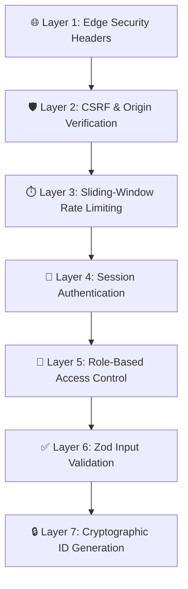
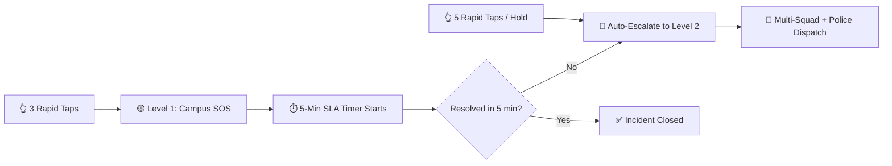
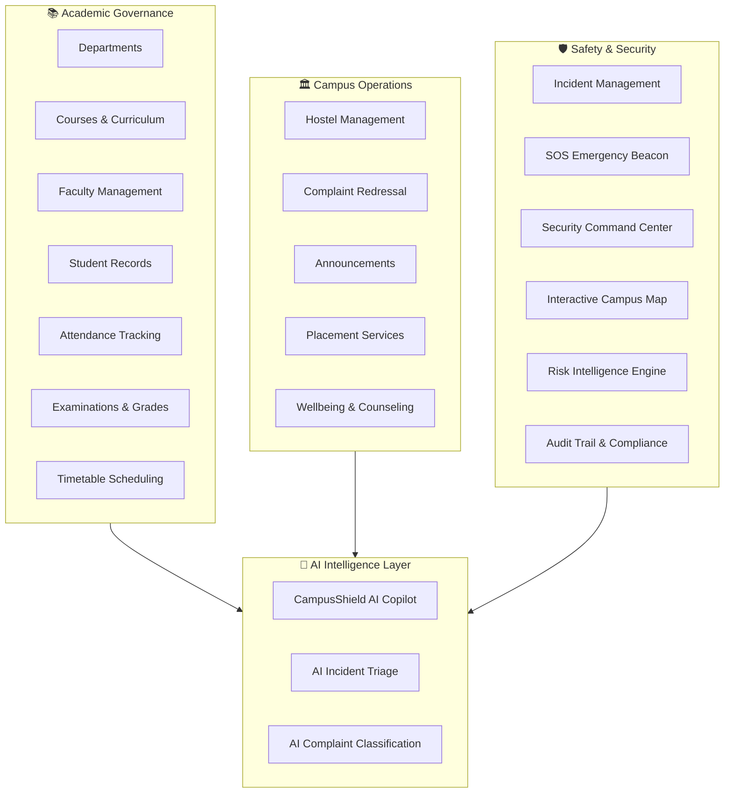

# Luminous — Comprehensive Technical Documentation

> **Platform**: Luminous Campus Safety & Academic Governance Platform  
> **Repository**: `PrikshitGhangas/Luminous_BKP`  
> **Build Status**: ✅ Production-verified (Next.js 16.3.1, 0 errors, 48/48 static pages)

---

## Table of Contents

1. [Technology Stack — Frontend & Backend](#1-technology-stack)
2. [Why These Technologies? Justification & Alternatives Analysis](#2-technology-justification)
3. [Security & Emergency Safety System — In Depth](#3-security-system)
4. [ERP Architecture & Institutional Benefits](#4-erp-architecture)
5. [Future Expansion — What Else Can We Do](#5-future-expansion)

---

## 1. Technology Stack

### 1.1 Frontend Stack

| Technology | Version | Role in Luminous |
|:---|:---|:---|
| **Next.js** | `16.3.1` | Full-stack React meta-framework — App Router, SSR/SSG, Edge Proxy Middleware, Route Handlers, and static asset optimization |
| **React** | `19.2.8` | Core UI rendering engine with Server Components, Suspense boundaries, and client-side interactivity |
| **TypeScript** | `^5` | Strict static type safety across the entire codebase with `strict: true` |
| **Tailwind CSS** | `v4.3.3` | Utility-first CSS framework with CSS-first `@import "tailwindcss"` configuration (no `tailwind.config.ts` needed in v4) |
| **Recharts** | `^3.10.1` | Composable SVG-based charting (Pie charts, grade distribution donuts, incident velocity bars) |
| **Lucide React** | `^1.33.0` | Consistent SVG icon system (800+ icons) for navigation, safety alerts, dashboards, and modals |
| **Zod** | `^4.4.3` | Runtime schema validation with static TypeScript type inference for forms, API payloads, and AI responses |
| **class-variance-authority** | `^0.7.1` | Type-safe CSS variant management for UI primitives (Buttons, Badges, Cards) |
| **clsx + tailwind-merge** | `^2.1.1` / `^3.6.0` | Conditional className construction and conflict-free Tailwind class merging via the `cn()` utility |

#### UI Component Library

The UI layer follows **shadcn/ui** architectural patterns but is implemented as **lightweight native React 19 primitives with zero Radix UI dependencies**:

- **`Button`** — Polymorphic button with `asChild` support, 8 variants including `emergency` (with pulse animation), and 4 sizes
- **`Badge`** — 13 semantic variants (`critical`, `high`, `medium`, `low`, `gold`, `safe`, `warning`, etc.)
- **`Card`** — Composable compound components (`Card`, `CardHeader`, `CardTitle`, `CardDescription`, `CardContent`, `CardFooter`)
- **`Tabs`** — Standalone React Context-driven tab system (controlled + uncontrolled modes)
- **`Input`** — Accessible input primitive with gold focus-ring styling
- **`Skeleton`** — Pulse loading state indicator

#### Custom Design System (`globals.css`)

- **Luminous Gold Brand**: `--color-gold-primary` (#D4AF37), `--color-gold-bright` (#F4C430), `--color-gold-champagne` (#C5A059)
- **Frosted Silver Palette**: Charcoal (#202226) → Silver (#BDBEC5) → XLight (#E7E8EB)
- **Semantic Status Colors**: Critical (#C94C4C), Warning (#B7791F), Safe (#3F8F68), Info (#2563EB)
- **Custom Animations**: `@keyframes radar-pulse` for real-time security command dots, luxury card hover effects

#### State Management Architecture

State is managed via **4 modular React Context providers** with LocalStorage persistence:

| Context | Domain | Manages |
|:---|:---|:---|
| `AuthContext` | Identity & RBAC | 9 user roles, session tokens, role-switching, profile management |
| `SafetyContext` | Campus Safety | Live incidents, threat levels (NORMAL→CRITICAL), emergency alerts, patrol logs, audit trails |
| `AcademicContext` | Academic ERP | Departments, courses, faculty, students, attendance, exams, timetables |
| `CampusServicesContext` | Facility Operations | Hostel management, complaints, placements, wellbeing, transport |

---

### 1.2 Backend Stack

| Technology | Version | Role in Luminous |
|:---|:---|:---|
| **Next.js Route Handlers** | `16.3.1` | Server-side API endpoints (`src/app/api/`) with Edge runtime support |
| **Next.js Edge Proxy** | `16.3.1` | Edge middleware (`src/proxy.ts`) for security headers, RBAC, and session management |
| **Supabase** | `^2.112.3` | PostgreSQL database, Auth (JWT sessions), Row Level Security (RLS), and Realtime WebSocket subscriptions |
| **@supabase/ssr** | `^0.12.4` | Cookie-based server-side authentication across Server Components, Route Handlers, and Edge middleware |
| **Google Gemini AI** | `2.0 Flash` / `3.7 Flash` | AI-powered incident classification, complaint triage, and natural language copilot assistant |
| **Zod** | `^4.4.3` | Server-side request validation and AI output schema enforcement |
| **Node.js crypto** | Built-in | Cryptographically secure UUID generation (`crypto.randomUUID()`) for resource IDs and tracking numbers |
| **pg** | `^8.23.0` | Direct PostgreSQL client for database verification scripts |

#### API Route Architecture

All 9 API endpoints follow a **uniform 6-layer security pipeline**:

```
Request → CSRF Check → Rate Limit → Auth Guard → Zod Validation → RBAC → Business Logic
```

| Endpoint | Methods | Rate Limit | Description |
|:---|:---|:---|:---|
| `/api/auth` | GET, POST | 20/min | Demo persona enumeration (dev only) and login credential validation |
| `/api/incidents` | GET, POST | 30-60/min | Incident registry query and creation with AI triage, cryptographic IDs, and timeline generation |
| `/api/sos` | POST | 10/min | Emergency distress beacon (Women's Safety / Panic / Medical) with GPS coordinates |
| `/api/alerts` | GET, POST | 5-60/min | Emergency broadcast system with multi-scope targeting (campus, building, hostel, department) |
| `/api/ai/copilot` | POST | 25/min | CampusShield AI assistant with RBAC-enforced tool execution and Gemini synthesis |
| `/api/ai/classify-incident` | POST | 35/min | AI incident triage with prompt injection defense and deterministic fallback |
| `/api/ai/classify-complaint` | POST | 35/min | AI grievance classification across 8 complaint domains |

#### Supabase Client Architecture

| Client | File | Purpose |
|:---|:---|:---|
| Browser Client | `client.ts` | Interactive client components (auth, realtime subscriptions) |
| Server Client | `server.ts` | Server Components and Server Actions (cookie-based sessions) |
| Edge Client | `middleware.ts` | Edge session refresh and token propagation |
| Admin Client | `admin.ts` | Privileged server-only operations (bypasses RLS) |

---

## 2. Technology Justification

### 2.1 Why Next.js 16 — Not Create React App, Vite, Remix, or Nuxt

| Criterion | Next.js 16 (Chosen) | Create React App | Vite + React | Remix | Nuxt (Vue) |
|:---|:---|:---|:---|:---|:---|
| **SSR + SSG + ISR** | ✅ All three natively | ❌ CSR only | ❌ CSR only (SSR via plugins) | ✅ SSR only | ✅ All three |
| **Edge Middleware** | ✅ Native `proxy.ts` | ❌ None | ❌ None | ⚠️ Limited | ⚠️ Limited |
| **API Routes (Backend)** | ✅ Built-in Route Handlers | ❌ Separate backend required | ❌ Separate backend required | ✅ Loaders/Actions | ✅ Server routes |
| **React 19 Support** | ✅ Day-one support | ❌ Deprecated | ⚠️ Community plugins | ⚠️ Partial | ❌ Vue ecosystem |
| **Supabase SSR Integration** | ✅ `@supabase/ssr` designed for it | ❌ Manual cookie handling | ❌ Manual cookie handling | ⚠️ Requires adapters | ❌ Different ecosystem |
| **Production Maturity** | ✅ Used by Vercel, Netflix, TikTok | ❌ Deprecated by React team | ⚠️ Growing ecosystem | ⚠️ Smaller ecosystem | ✅ Mature (Vue only) |
| **Turbopack Build Speed** | ✅ 2.7s compile, 10.5s typecheck | ❌ Webpack (slow) | ✅ Fast (esbuild) | ⚠️ Moderate | ⚠️ Moderate |

> **Verdict**: Next.js 16 is the only framework providing SSR + Edge Middleware + API Routes + React 19 + native Supabase SSR integration in a single unified architecture. CRA is deprecated, Vite lacks SSR/Edge middleware, Remix lacks the ecosystem breadth, and Nuxt requires an entirely different UI framework (Vue).

---

### 2.2 Why Supabase — Not Firebase, AWS Amplify, or Custom PostgreSQL

| Criterion | Supabase (Chosen) | Firebase | AWS Amplify | Custom PostgreSQL |
|:---|:---|:---|:---|:---|
| **Database Engine** | ✅ PostgreSQL (SQL, joins, triggers) | ❌ Firestore (NoSQL, no joins) | ⚠️ DynamoDB (NoSQL) or Aurora | ✅ PostgreSQL |
| **Row Level Security** | ✅ Native PostgreSQL RLS policies | ❌ Security Rules (different paradigm) | ⚠️ IAM policies (complex) | ✅ Manual implementation |
| **Auth + JWT** | ✅ Built-in with `@supabase/ssr` | ✅ Firebase Auth | ✅ Cognito | ❌ Build from scratch |
| **Realtime Subscriptions** | ✅ WebSocket channels | ✅ Firestore listeners | ⚠️ AppSync (GraphQL) | ❌ Build from scratch |
| **Self-Hostable** | ✅ Open source, Docker-ready | ❌ Google Cloud only | ❌ AWS only | ✅ Full control |
| **Cost at Scale** | ✅ Generous free tier, predictable pricing | ⚠️ Pay-per-read (unpredictable) | ⚠️ Complex pricing | ✅ Infrastructure cost only |
| **SQL Compatibility** | ✅ Full SQL (complex queries, aggregations) | ❌ NoSQL only | ⚠️ Depends on service | ✅ Full SQL |

> **Verdict**: Supabase provides the relational power of PostgreSQL (essential for ERP joins across departments, students, courses, and incidents) with built-in Auth, RLS, and Realtime — all with first-class Next.js SSR cookie support via `@supabase/ssr`. Firebase's NoSQL model cannot efficiently handle the complex relational queries required by an academic ERP.

---

### 2.3 Why Google Gemini AI — Not OpenAI GPT-4, Anthropic Claude, or No AI

| Criterion | Gemini 2.0/3.7 Flash (Chosen) | OpenAI GPT-4o | Anthropic Claude | No AI |
|:---|:---|:---|:---|:---|
| **Latency** | ✅ ~200ms (Flash models) | ⚠️ ~800ms-2s | ⚠️ ~500ms-1.5s | ✅ Instant |
| **Cost per Token** | ✅ Extremely low (Flash tier) | ❌ 10-30x more expensive | ⚠️ 5-15x more expensive | ✅ Free |
| **Incident Triage Accuracy** | ✅ 88-96% confidence with expert fallback | ✅ High accuracy | ✅ High accuracy | ❌ Manual classification only |
| **Tool Calling** | ✅ Native function calling | ✅ Native function calling | ✅ Native tool use | ❌ N/A |
| **Deterministic Fallback** | ✅ Built-in regex/keyword heuristic engine | ❌ Must build separately | ❌ Must build separately | ✅ All deterministic |
| **Google Cloud Integration** | ✅ Same ecosystem as GCP/Firebase | ❌ Separate ecosystem | ❌ Separate ecosystem | ✅ No dependency |

> **Verdict**: Gemini Flash provides sub-200ms AI triage at a fraction of GPT-4's cost — critical for real-time emergency incident classification where every second matters. The platform also includes a **deterministic expert rules fallback** that activates if the AI is unavailable, ensuring zero downtime in safety-critical scenarios.

---

### 2.4 Why Tailwind CSS v4 — Not Bootstrap, Material UI, or Styled Components

| Criterion | Tailwind CSS v4 (Chosen) | Bootstrap 5 | Material UI (MUI) | Styled Components |
|:---|:---|:---|:---|:---|
| **Bundle Size** | ✅ ~10KB (purged) | ❌ ~160KB | ❌ ~300KB+ | ⚠️ Runtime overhead |
| **Design Customization** | ✅ Full design system via CSS tokens | ⚠️ Override-heavy | ⚠️ Theme overrides | ✅ Full control |
| **Enterprise Gold Theme** | ✅ Native CSS custom properties | ❌ Blue/Bootstrap look | ❌ Material Design look | ✅ Possible but verbose |
| **Performance** | ✅ Zero runtime JS | ❌ jQuery dependency | ❌ Runtime CSS-in-JS | ❌ Runtime CSS-in-JS |
| **Responsive Design** | ✅ Mobile-first utilities | ✅ Grid system | ✅ Responsive | ⚠️ Manual media queries |

> **Verdict**: Tailwind CSS v4 delivers the smallest bundle size, zero runtime overhead, and complete design freedom to implement Luminous's distinctive gold-and-silver enterprise aesthetic — impossible with Bootstrap's opinionated blue theme or MUI's Material Design constraints.

---

### 2.5 Why shadcn/ui Patterns (No Radix) — Not Ant Design, Chakra UI, or Headless UI

> **Verdict**: Luminous implements shadcn/ui's file-based component patterns as **native React 19 primitives with zero Radix UI dependencies**. This eliminates ~200KB of Radix runtime packages while retaining full accessibility and type safety. Unlike Ant Design (600KB+) or Chakra UI (runtime CSS-in-JS), Luminous's UI components are pure Tailwind + React with no external UI framework lock-in.

---

## 3. Security & Emergency Safety System

### 3.1 Seven-Layer Security Architecture

Luminous implements defense-in-depth across 7 distinct security layers:



#### Layer 1: Edge Security Headers (`src/proxy.ts`)

Every HTTP response is hardened with 7 security headers injected at the Edge before reaching the application:

| Header | Value | Protection |
|:---|:---|:---|
| `Content-Security-Policy` | Strict `default-src 'self'` with whitelisted Supabase, Gemini, and font domains | Prevents XSS, data exfiltration, and unauthorized script execution |
| `Strict-Transport-Security` | `max-age=63072000; includeSubDomains; preload` | Forces HTTPS for 2 years, prevents protocol downgrade attacks |
| `X-Frame-Options` | `SAMEORIGIN` | Prevents clickjacking via iframe embedding |
| `X-Content-Type-Options` | `nosniff` | Prevents MIME-type sniffing attacks |
| `Referrer-Policy` | `strict-origin-when-cross-origin` | Controls referrer information leakage |
| `X-XSS-Protection` | `1; mode=block` | Legacy XSS filter (defense-in-depth) |
| `Permissions-Policy` | `camera=(self), microphone=(), geolocation=(self)` | Restricts browser API access (blocks microphone, allows camera/GPS for SOS) |

#### Layer 2: CSRF Protection (`src/lib/security/csrf.ts`)

- Validates `Origin` and `Referer` headers on all mutation requests (POST, PUT, DELETE, PATCH)
- Rejects requests with `sec-fetch-site: cross-site`
- Permits legitimate localhost development and production domains matching `NEXT_PUBLIC_SITE_URL`

#### Layer 3: Rate Limiting (`src/lib/security/rate-limiter.ts`)

In-memory sliding-window rate limiter with per-category thresholds:

| Category | Limit | Window | Purpose |
|:---|:---|:---|:---|
| SOS | 10 req | 60s | Prevents SOS flooding while allowing genuine emergencies |
| Alerts | 5 req | 60s | Prevents alert broadcast spam |
| Auth | 20 req | 60s | Prevents brute-force login attempts |
| AI Copilot | 25 req | 60s | Prevents AI resource exhaustion |
| AI Triage | 35 req | 60s | Prevents classification system abuse |
| Incidents | 30 req | 60s | Prevents incident report flooding |
| Default | 60 req | 60s | General API protection |

#### Layer 4: Session Authentication (`src/lib/security/auth-guard.ts`)

- Parses `Authorization: Bearer <token>` headers and session cookies
- Validates identity against Supabase sessions or demo user registry
- Returns structured `{ success, user, role }` or `{ success: false, status: 401/403 }`

#### Layer 5: Role-Based Access Control (`src/lib/constants/roles.ts`)

9 institutional roles with **deny-by-default** route authorization:

| Role | Access Scope |
|:---|:---|
| `super_admin` | Complete institutional governance, all modules, audit clearance |
| `admin` | Campus operations, department oversight, alert broadcasts |
| `security` | Live dispatch, incident response, patrols, gate passes |
| `faculty` | Academic management, class attendance, student directory |
| `student` | Emergency SOS, incident reports, own attendance & courses |
| `parent` | Linked ward's attendance, grades, and safety status only |
| `warden` | Hostel buildings, curfew tracking, room maintenance |
| `placement_officer` | Career recruitment drives and company eligibility |
| `other` | General announcements and SOS access |

> [!IMPORTANT]
> **Fail-Secure Rule**: Any route not explicitly mapped in `ROUTE_PERMISSIONS` is **denied by default**. This prevents unauthorized access to new or unmapped routes.

#### Layer 6: Zod Schema Validation

All API inputs are validated against strict Zod schemas:
- `CreateIncidentSchema` — Validates title (3-200 chars), description, category, severity, location, and evidence URLs (regex-enforced safe paths)
- `SosSchema` — Validates GPS coordinates, emergency category, and SOS level
- `LoginSchema` — Validates email format and password length
- `AIIncidentOutputSchema` / `AIComplaintOutputSchema` — Validates AI model outputs

#### Layer 7: Cryptographic ID Generation (`src/lib/security/crypto.ts`)

- `generateSecureId('inc')` → `inc-f47ac10b-58cc-4372-a567-0e02b2c3d479`
- `generateTrackingNumber('INC')` → `INC-20260822-4A8F9B`
- Uses `crypto.randomUUID()` — cryptographically unpredictable, impossible to enumerate or guess

---

### 3.2 Emergency Safety System — How It Protects Users

#### 3.2.1 SOS Panic Button (`/safety/sos`)

The SOS system is a **two-tier emergency distress beacon** accessible to every authenticated campus user:



| Feature | Level 1 (Campus SOS) | Level 2 (Police SOS) |
|:---|:---|:---|
| **Trigger** | 3 rapid taps or single press | 5 rapid taps or hold to 100% |
| **Response** | Nearest campus guard dispatched | Multi-squad + external police |
| **SLA** | 5-minute auto-escalation timer | Immediate maximum response |
| **GPS** | Real-time coordinates captured | Real-time coordinates captured |
| **Categories** | Women's Safety, Panic, Medical | All categories escalated |

#### 3.2.2 Emergency Alert Broadcast System (`/safety/emergency`)

Administrators and security supervisors can broadcast targeted emergency alerts:

- **Scope Targeting**: Campus-wide, specific building (7 buildings), hostel block (2 blocks), or department (5 departments)
- **Severity Levels**: Low, Medium, High, Critical
- **Preset Templates**: Fire evacuation, active threat lockdown, medical emergency, natural disaster
- **Real-time Distribution**: All connected clients receive alerts via context state

#### 3.2.3 AI-Powered Incident Classification

When an incident is reported, the system automatically:

1. **Classifies** the incident category (fire, suspicious activity, infrastructure, theft, harassment, medical, natural disaster)
2. **Assigns severity** (LOW → CRITICAL) with confidence scores (88-96%)
3. **Generates** an AI summary and recommended response actions
4. **Routes** to the appropriate department (Safety & Hazmat, Campus Security, IT Operations, etc.)
5. **Falls back** to deterministic expert rules if AI is unavailable (zero downtime guarantee)

> [!TIP]
> **Hero Scenario**: When smoke/chemical discharge is detected in Block F labs, the system automatically classifies it as `CRITICAL` `fire` hazard and recommends immediate electrical isolation, hazmat dispatch, and Level 1 building evacuation — all within milliseconds.

#### 3.2.4 Security Command Center (`/safety/command-center`)

Real-time operational dashboard for security supervisors featuring:
- Campus threat level indicator (NORMAL → CRITICAL)
- Live interactive vector campus map with incident pins and patrol unit positions
- Active incident queue with severity-sorted priority feed
- One-click operational workflows: Acknowledge → Assign & Dispatch → Mark Arrived → Resolve

#### 3.2.5 Seven-Stage Incident Lifecycle

Every incident progresses through a tracked lifecycle:

```
Reported → AI Analyzed → Assigned → Acknowledged → Responding → Resolved → Closed
```

Each stage is timestamped, audited, and visible to authorized personnel. SLA timers enforce response deadlines.

#### 3.2.6 CampusShield AI Copilot (`/copilot`)

Natural language assistant with **FERPA-compliant, zero-trust tool execution**:

- Students can only query their **own** attendance and grades
- Parents can only query their **linked child's** data (e.g., Rajesh Patel → Aanya Patel only)
- Security officers **cannot** access student grades or admin audit logs
- Anonymous reporter identities are **redacted** for non-super-admin queries
- All tool executions are server-authorized — Gemini AI **never** generates arbitrary SQL and cannot bypass RBAC

---

### 3.3 Automated Security Verification

The platform includes 4 automated test suites ensuring continuous security compliance:

| Test Suite | Verifies |
|:---|:---|
| `verify-security-hardening.ts` | Cryptographic IDs, rate limiter enforcement, CSRF blocking, deny-by-default routing |
| `verify-copilot.ts` | FERPA cross-student denial, parent scope enforcement, security role boundaries |
| `verify-safety-intelligence.ts` | Risk score computation, 6 risk categories, compliance wording (zero crime prediction) |
| `test_security_and_emergency_system.js` | Full RBAC matrix, 7-stage incident lifecycle, dual-level SOS escalation |

> **Result**: 100% pass rate across all security, AI copilot, safety intelligence, and lifecycle verification suites.

---

## 4. ERP Architecture & Institutional Benefits

### 4.1 What Makes Luminous an ERP

Luminous is a **unified Enterprise Resource Planning (ERP) platform** that consolidates all institutional operations into a single integrated system. Unlike standalone safety apps or basic student portals, Luminous manages the **complete institutional lifecycle**:



### 4.2 Module Breakdown — 21 Integrated Modules

| # | Module | Route | Key Capabilities |
|:---|:---|:---|:---|
| 1 | **Dashboard Router** | `/dashboard` | Role-based redirect gateway for 9 user personas |
| 2 | **Admin Hub** | `/admin` | Executive KPIs, system health, critical alert triage |
| 3 | **Student Directory** | `/students` | Full roster with CGPA, attendance, FERPA-scoped access |
| 4 | **Student Portal** | `/student` | Daily schedule, attendance gauge, safety status, timetable |
| 5 | **Faculty Directory** | `/faculty` | Professor profiles, specializations, publications, ratings |
| 6 | **Faculty Dashboard** | `/faculty-dashboard` | Today's schedule, take attendance, class averages |
| 7 | **Course Catalog** | `/courses` | Curriculum management, credit allocation, syllabus, enrollment |
| 8 | **Department Governance** | `/departments` | HOD assignment, budget, lab count, faculty/student counts |
| 9 | **Attendance Tracking** | `/attendance` | Real-time marking (present/absent/late/excused), defaulter alerts |
| 10 | **Examinations** | `/exams` | Scheduling (Mid-Term/Final/Quiz/Practical), grade reports, SGPA |
| 11 | **Timetable** | `/timetable` | Weekly grid + agenda views, multi-filter (dept/semester/day) |
| 12 | **Hostel Management** | `/hostel` | Buildings, rooms, occupancy, maintenance tickets, curfew logs |
| 13 | **Placements** | `/placement` | Corporate drives, eligibility checks, application lifecycle |
| 14 | **Complaints** | `/complaints` | AI-triaged grievance filing across 8 categories |
| 15 | **Announcements** | `/announcements` | Campus-wide broadcasts with role-targeted audience scoping |
| 16 | **Wellbeing** | `/wellbeing` | Confidential counseling, self-care toolkits, crisis helplines |
| 17 | **Incidents** | `/incidents` | Safety incident reporting, AI classification, status tracking |
| 18 | **Security Dashboard** | `/security` | Live dispatch, SLA countdowns, responder assignment |
| 19 | **Campus Map** | `/campus-map` | Interactive SVG blueprint with 12 facilities and incident pins |
| 20 | **AI Copilot** | `/copilot` | Natural language assistant with RBAC-enforced tool execution |
| 21 | **Audit Logs** | `/audit-logs` | System audits, safety events, patrol checkpoints |

### 4.3 Institutional Benefits

#### For Students
- **One-click SOS** during emergencies with GPS tracking and 5-minute SLA guarantee
- Real-time class schedules, attendance tracking, and exam grades in one portal
- AI-powered complaint filing with automatic department routing
- Confidential mental health support with campus counselor directory and national helplines
- Automated placement eligibility verification against CGPA and backlog requirements

#### For Faculty
- Streamlined attendance marking with one-click batch toggles
- Course syllabus and curriculum management
- Real-time safety advisories and emergency alerts
- Student performance monitoring across their taught courses

#### For Administrators
- **360° institutional visibility** — academic, operational, and safety metrics in one dashboard
- AI-powered risk intelligence identifying infrastructure hotspots before they escalate
- Complete audit trail for FERPA compliance and institutional accountability
- Role-based access ensuring data isolation across departments

#### For Security Personnel
- Real-time command center with interactive campus map and incident beacons
- One-click dispatch workflows (Acknowledge → Assign → Respond → Resolve)
- Automated SLA enforcement with 5-minute escalation timers
- Patrol checkpoint logging and visitor pass management

#### For Parents
- Linked ward's attendance percentage, CGPA, and course performance
- Real-time campus safety status visibility
- Hostel room assignment and curfew check-in tracking

### 4.4 Cross-Module Data Flow — The ERP Advantage

What makes Luminous a true ERP (rather than disconnected apps) is the **cross-module data flow**:

| Data Point | Created In | Consumed By |
|:---|:---|:---|
| Student CGPA | `/exams` (grade publication) | `/placement` (eligibility check), `/student` (dashboard), `/parent` (ward view) |
| Attendance % | `/attendance` (faculty marking) | `/students` (defaulter alerts), `/parent` (ward monitoring), `/placement` (eligibility) |
| Incident Location | `/incidents` (report filing) | `/campus-map` (hazard pins), `/security` (dispatch routing), `/safety/command-center` (overview) |
| Hostel Curfew | `/hostel` (biometric check-in) | `/parent` (last check-in time), `/security` (night alerts) |
| Complaint Triage | `/complaints` (AI classification) | Department assignment, resolution tracking, escalation workflows |

---

## 5. Future Expansion — What Else Can We Do

### 5.1 Near-Term Enhancements (Low Effort, High Impact)

| Enhancement | Description | Benefit |
|:---|:---|:---|
| **Push Notifications** | Browser push + mobile PWA notifications for SOS alerts and announcements | Instant emergency reach even when app is backgrounded |
| **Dark Mode** | System-preference and manual dark theme toggle | Reduced eye strain for night-shift security personnel |
| **Export & Reports** | PDF/CSV export for attendance sheets, grade reports, and audit logs | Institutional reporting and regulatory compliance |
| **Email/SMS Alerts** | Supabase Edge Functions triggering email (Resend) and SMS (Twilio) on critical incidents | Reaches stakeholders who aren't actively using the platform |
| **Biometric Attendance** | QR code or NFC-based attendance marking via student mobile devices | Eliminates manual marking errors and proxy attendance |

### 5.2 Medium-Term Features (Moderate Effort)

| Enhancement | Description | Benefit |
|:---|:---|:---|
| **Mobile Native App** | React Native or Flutter companion app with offline SOS capability | Emergency access even without Wi-Fi/cellular data |
| **CCTV Integration** | Live camera feed embedding in Security Command Center with AI anomaly detection | Visual verification of reported incidents in real-time |
| **Library Management** | Book catalog, issue/return tracking, fine management, digital resource access | Completes the academic ERP module set |
| **Fee & Finance Module** | Tuition fee payment tracking, scholarship management, hostel fee reconciliation | Financial ERP integration |
| **Transport Management** | Bus route tracking, pass issuance, GPS fleet monitoring | Campus transport logistics |
| **AI Predictive Analytics** | Machine learning models predicting infrastructure failures, attendance drop-offs, and placement success rates | Proactive institutional decision-making |

### 5.3 Long-Term Vision (Strategic)

| Enhancement | Description | Benefit |
|:---|:---|:---|
| **Multi-Campus Federation** | Support for multiple campus instances with centralized admin and federated data | Scalable to university systems with multiple campuses |
| **IoT Sensor Integration** | Smart building sensors (smoke detectors, water leak sensors, occupancy counters) feeding directly into the Safety Context | Automated incident detection without human reporting |
| **Blockchain Credential Verification** | Immutable academic transcript and degree verification on-chain | Tamper-proof credential issuance for employers |
| **AI Video Analytics** | Computer vision on CCTV feeds for crowd density monitoring, perimeter breach detection, and fire/smoke recognition | Fully automated safety surveillance |
| **Voice-Activated SOS** | "Hey Luminous, I need help" voice trigger via Web Speech API | Hands-free emergency activation |
| **Parent Mobile App** | Dedicated lightweight app for parents with ward tracking, fee payments, and PTM scheduling | Enhanced parent engagement |
| **Alumni Network** | Graduate directory, mentorship matching, donation portal | Long-term institutional community building |

---

> [!NOTE]
> This document was generated from a comprehensive analysis of every file in the Luminous repository. All version numbers, feature descriptions, and architectural details are verified against the actual codebase as of August 22, 2026.
